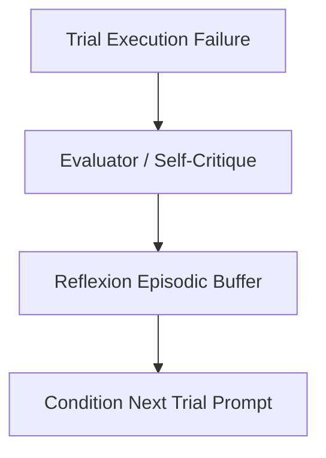

# genpark-reflexion-episodic-critique-memory-buffer-skill

Reflexion episodic failure memory buffer accumulating self-critiques and trial corrective plans across autonomous trials.

## Architecture

## Features
- **Episodic Retention**: Maintains sliding window of past trial reflections.
- **Zero Dependencies**: 100% Python Standard Library.
